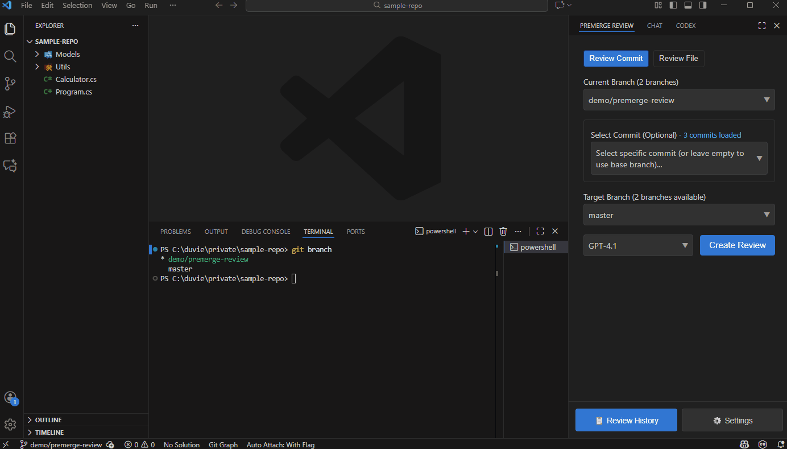
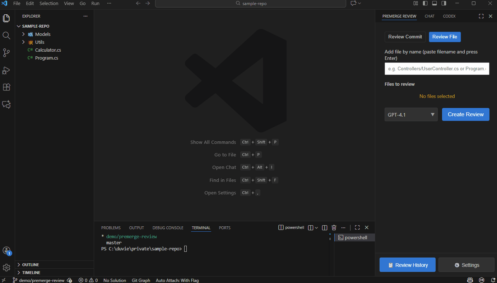

# PreMerge Review

**PreMerge Review** is a Visual Studio Code extension that helps developers perform AI-assisted code reviews _before_ merging their feature branches. It generates a smart review prompt from the Git diff between branches, optionally using your team's custom review instructions.

## Features

**Commit Review**: Select any two commits (on the same branch or across branches) to review code changes between them

**File/Folder Review**: Select multiple files or a folder to review the content of all included files.

