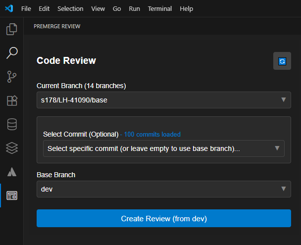
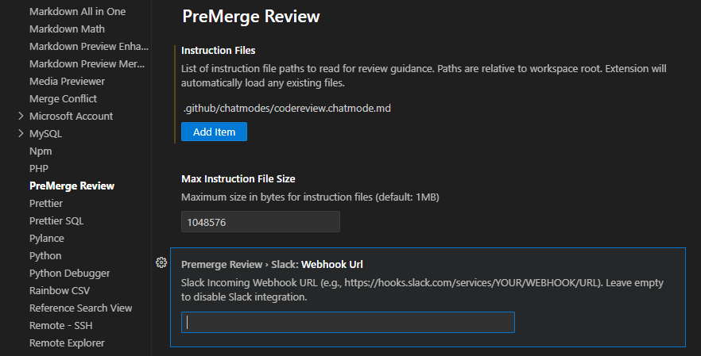
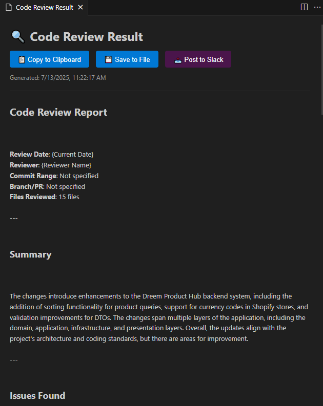

**PreMerge Review** is a Visual Studio Code extension that helps developers perform AI-assisted code reviews _before_ merging their feature branches. It generates a smart review prompt from the Git diff between branches, optionally using your team’s custom review instructions.

---

## 🚀 Features

- 📍 Compare your current branch with a target base branch (e.g., `dev`)
- 🧾 Generate a full Git diff (`git diff base...feature`)
- 📘 Read custom instructions from `.github/instructions/`
- ✍️ Automatically build a review prompt from diff + instruction
- 🤖 Send the prompt to an AI model (Copilot, OpenAI, etc.) for review suggestions
- 📤 (Optional) Notify the team with review results via Slack

---

## 🛠️ Usage

1. Open any Git-enabled project in VSCode.
2. Open the **PreMerge Review** tab in the primary sidebar.
3. Select your **target branch** (default: `dev`).
4. Click **Create Review**.
5. View the review result in the panel or copy it for further action.

---

## ⚙️ Configuration (coming soon)

- Default base branch
- File exclusion patterns
- AI model provider (OpenAI, Copilot, etc.)
- Slack webhook URL

---

## 📸 UI Preview







---
<!-- 
## 💡 Motivation

Modern teams are often too busy to review every commit thoroughly before merging. PreMerge Review helps automate and streamline the code review process — making it **faster**, **consistent**, and **smarter**, without waiting for a pull request.

--- -->

<!-- ## 📥 Installation

Search for `PreMerge Review` on the VSCode Marketplace  
or run:

```bash
ext install premerge-review -->

## 🧑‍💻 License

MIT License — created with ❤️ by your dev team.